# 💬 Modern Real-Time Chat Application

A full-stack chat application built with a **Flutter** client and a **Django** backend. The app supports real-time messaging, unread tracking, friend requests, group chats, push notifications, and local persistence for a smoother chat experience.

<p align="center">
        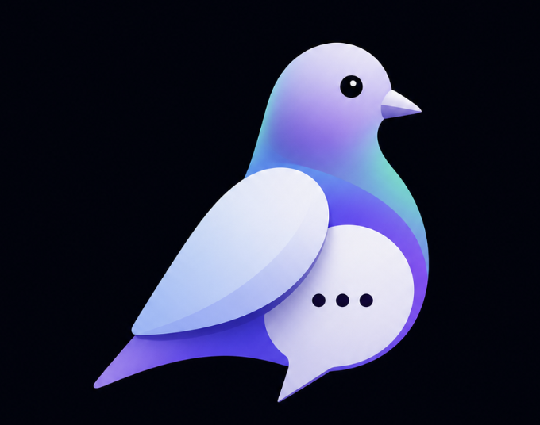
</p>

## Overview

The Flutter app is the primary user-facing client. It handles authentication, room browsing, chat screens, unread badges, friend discovery, and message rendering. The backend provides the REST API, WebSocket channels, room persistence, friendship workflow, and message read-state tracking.

## Features

### Flutter Client

- **Beautiful branded launch flow**: The app uses `assets/images/logo.png` for the splash screen and launcher icons so the branding is consistent from install time to startup.
- **Logo-driven experience**: The same logo is shown in the README and in-app splash flows, so the project feels visually consistent across documentation and the client.
- **JWT authentication and session restore**: Login tokens are stored in Hive and reused automatically so the user stays signed in across launches.
- **Room list with unread badges**: The chat list is loaded from the API and the unread count comes from the server response, which keeps the list in sync after refreshes.
- **Unread section**: Rooms are filtered locally by `unreadCount > 0`, so the unread tab reflects the same state used by the badges.
- **Real-time chat**: Messages stream over WebSockets through `ChatService` and are managed in the UI with Provider.
- **Read receipts and read persistence**: When a chat is opened, the client marks the room as read on the backend and updates local state so unread counts stay accurate.
- **Typing indicators**: The websocket layer forwards typing events so active conversations feel live.
- **Friend requests and suggestions**: The suggested-friends flow lets users send requests directly from the app.
- **Group chat support**: Users can create group rooms and manage conversations in the same room list.
- **Local message persistence**: Recent messages are cached in Hive so rooms can reopen quickly and still show recent content when network conditions are poor.
- **Account switching safety**: Chat state is reinitialized when the active user changes so messages and sender identity do not leak across sessions.

## Flutter State Management

The Flutter app uses the **Provider** pattern to keep UI, network state, and local persistence separated. Each provider owns one part of the app state and the screens rebuild only when the relevant data changes.

### Providers

- **AuthProvider**: Owns authentication state, session restore, logout, and the current login status.
- **RoomProvider**: Owns the room list, unread counts, room refreshes, and room-level read state.
- **ChatProvider**: Owns the active room conversation, message stream, typing state, read receipts, and message persistence for the open chat.
- **FriendProvider**: Owns friend lists, incoming/outgoing requests, and friend actions like request, accept, reject, and remove.

### How the State Flows

1. The app starts by restoring authentication from Hive-backed token storage.
2. After login, `AuthProvider` determines which home screen should be shown.
3. `RoomProvider` fetches the room list from the backend and keeps the unread badges in sync with the server response.
4. When a user opens a chat, `ChatProvider` loads cached messages first and then falls back to the REST API if needed.
5. The WebSocket connection streams live messages into `ChatProvider`, which updates the UI immediately and persists the message locally.
6. `RoomProvider` listens for message activity and updates the unread state when a new incoming message arrives.
7. When the chat screen becomes active, the room is marked as read both locally and on the backend, so the unread badge and unread tab stay consistent.

### Why This Approach

- It keeps authentication, rooms, chat messages, and friends independent instead of mixing everything into one large global state object.
- It makes chat updates fast because only the active conversation and related room entry need to rebuild.
- It allows local cache and server state to work together, which helps the app load quickly and stay usable when the network is slow.

## Screenshots

The main visual flow is documented in the root [images/](images) folder.

### Welcome and Authentication

<p align="center">
        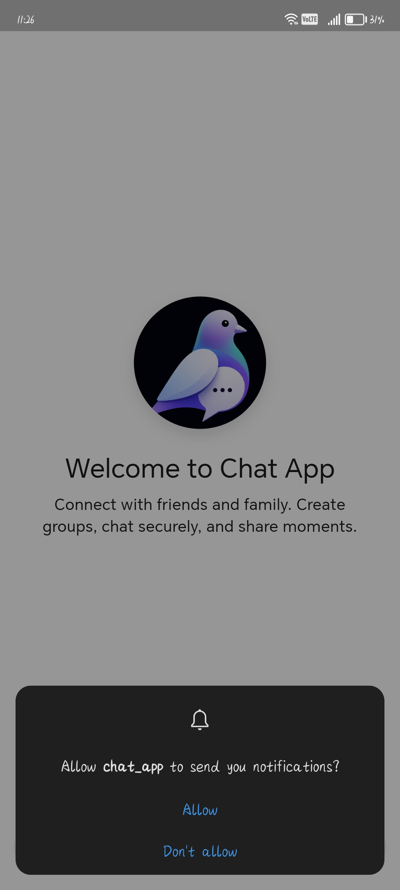
</p>

<p align="center">
        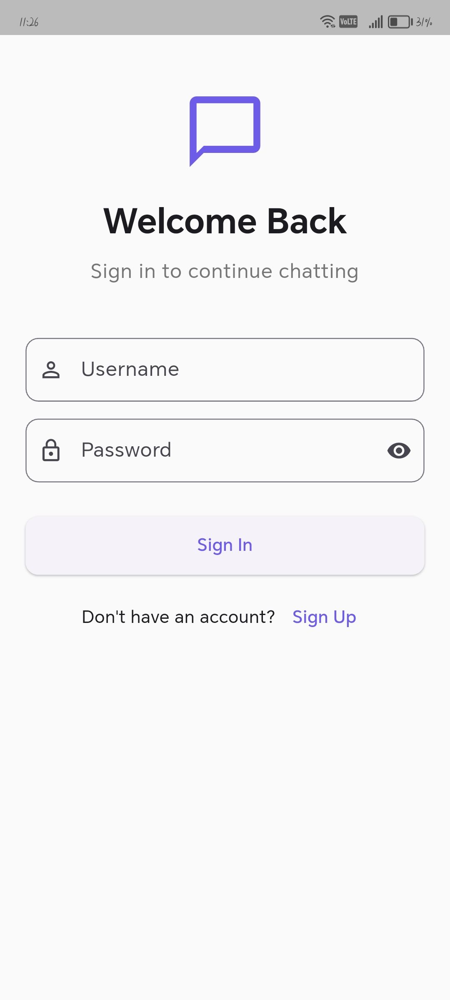
        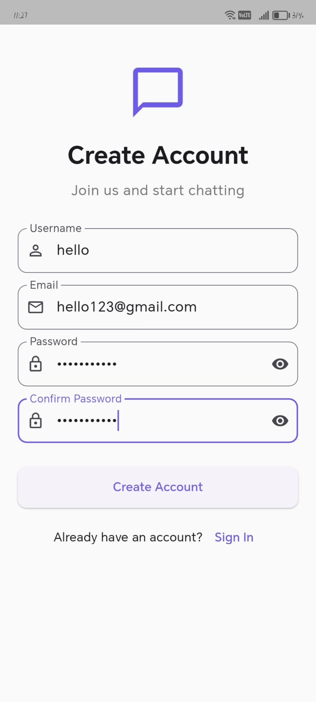
</p>

### Dashboard and Discovery

<p align="center">
        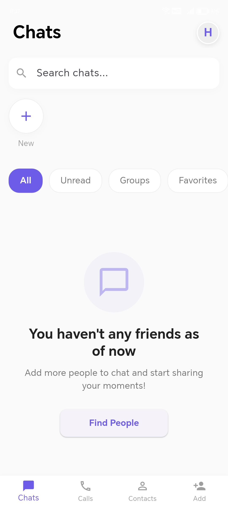
        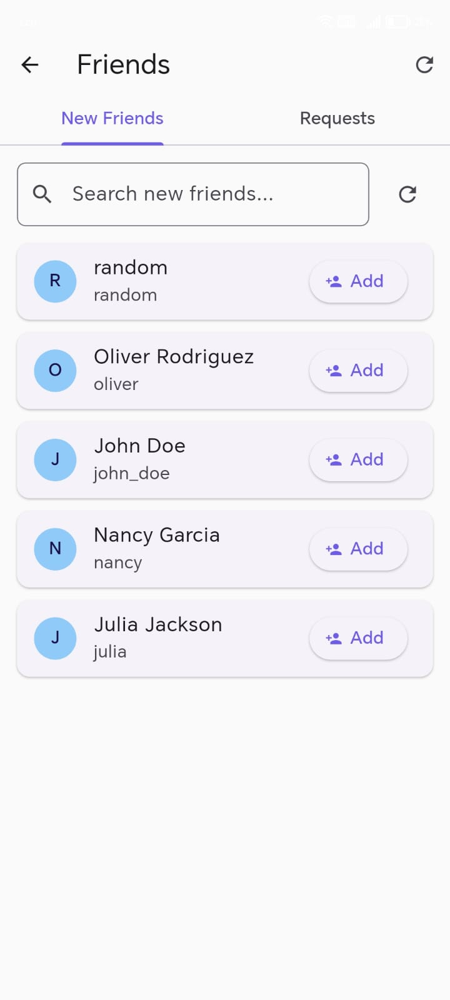
</p>

<p align="center">
        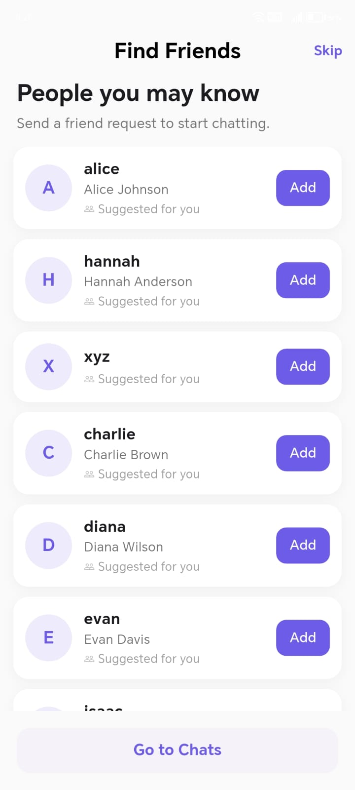
        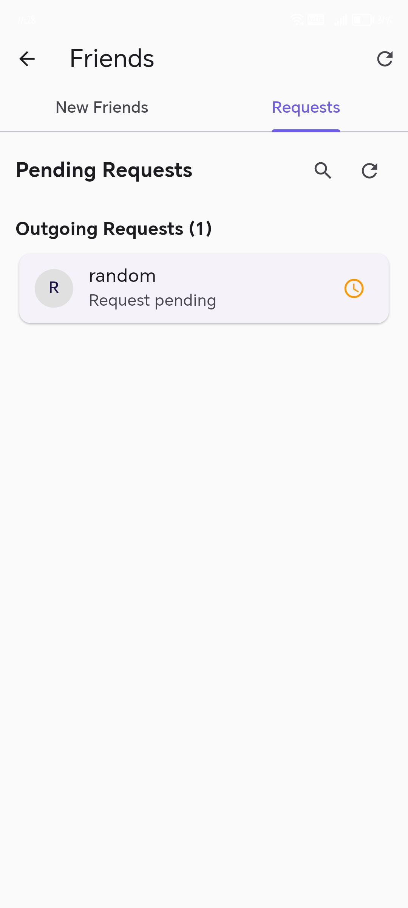
</p>

### Chat Experience

<p align="center">
        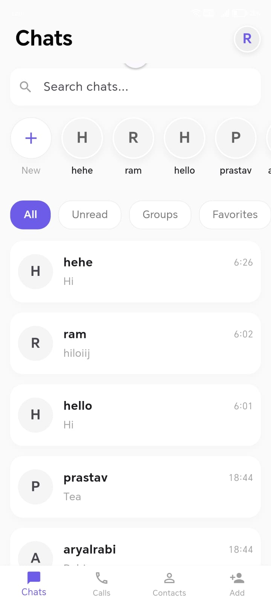
        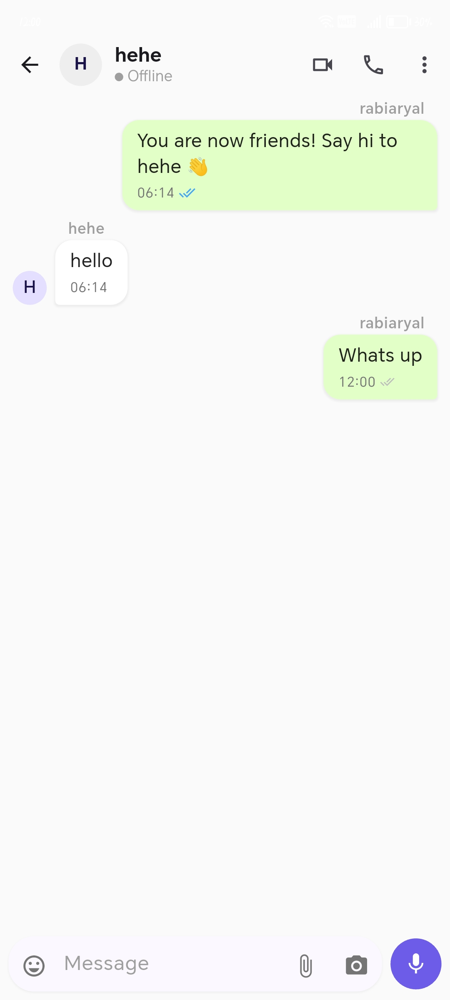
</p>

<p align="center">
        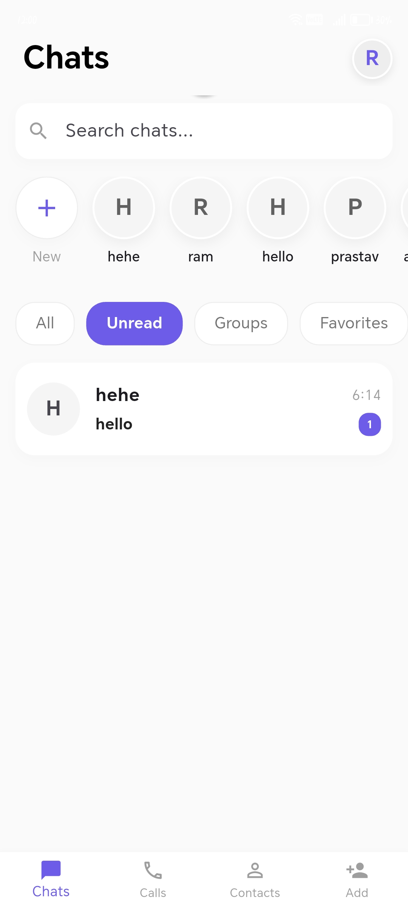
</p>

### Profile

<p align="center">
        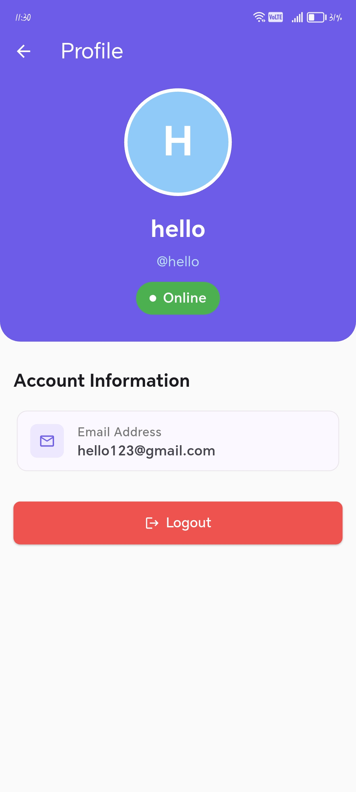
</p>

### Backend and Infrastructure

- **REST API with Django REST Framework**: Handles login, profile lookup, room loading, friend requests, room read updates, and message retrieval.
- **WebSocket messaging with Django Channels**: Real-time message delivery, typing events, secure message forwarding, and read receipt events are handled in the consumer layer.
- **Unread persistence**: Message read state is stored on the server with the `Message.is_read` field and room lists expose `unread_count` for the Flutter client.
- **Friendship workflow**: Friend requests are created, accepted, rejected, and listed through dedicated backend endpoints.
- **Database-backed chat rooms**: Rooms and direct-message relationships are persisted in PostgreSQL so they survive app restarts.
- **Push notifications**: FCM support is wired through the backend notification flow for new-message delivery.
- **Containerized deployment**: The project is set up with Docker and Docker Compose for local development and repeatable deployment.

## API Surface

The backend exposes **29 REST endpoints** and **1 websocket route**.

### REST APIs

#### Authentication and session

- `POST /api/v1/auth/register/`
- `POST /api/v1/auth/login/`
- `POST /api/v1/auth/logout/`
- `POST /api/v1/auth/token/refresh/`
- `POST /api/v1/auth/change-password/`

#### User management

- `GET /api/v1/user/me/`
- `DELETE /api/v1/user/delete/`
- `GET /api/v1/user/search/`
- `GET /api/v1/user/suggested/`
- `GET /api/v1/users/suggested/`

#### Rooms and messages

- `GET /api/v1/rooms/`
- `POST /api/v1/rooms/create-group/`
- `POST /api/v1/rooms/direct/<friend_id>/`
- `POST /api/v1/rooms/<room_id>/read/`
- `GET /api/v1/rooms/<room_id>/messages/`
- `GET /api/v1/rooms/<room_id>/members/`
- `POST /api/v1/rooms/<room_id>/members/`
- `DELETE /api/v1/rooms/<room_id>/members/<user_id>/`
- `POST /api/v1/chat/initialize/`

#### Friendship

- `POST /api/v1/friendship/request/`
- `POST /api/v1/friendship/accept/`
- `POST /api/v1/friendship/reject/`
- `GET /api/v1/friendship/requests/incoming/`
- `GET /api/v1/friendship/requests/outgoing/`
- `GET /api/v1/friends/`
- `DELETE /api/v1/friends/<friend_id>/`

#### E2EE keys and devices

- `POST /api/v1/keys/upload/`
- `GET /api/v1/keys/<user_id>/`
- `POST /api/v1/devices/register/`
- `POST /api/v1/devices/unregister/`

### WebSocket Route

- `WS /ws/chat/<room_id>/`

### Why WebSocket Is Used

WebSocket keeps the chat experience live without polling. The Flutter client uses it to send and receive messages instantly, deliver typing indicators, synchronize read receipts, and update unread badge state as new messages arrive. The REST API handles the slower persistent operations like login, room loading, friendship changes, and read-state refreshes.

## How It Works

1. **Authentication**: The Flutter client logs in through the API, saves access and refresh tokens in Hive, and restores the session on launch.
2. **Room loading**: `RoomProvider` fetches chat rooms from the backend, including the last message, unread count, and direct-message metadata.
3. **Opening a chat**: Tapping a room opens `ChatScreen`, initializes the `ChatProvider`, connects the WebSocket, and marks the room as read.
4. **Sending messages**: The client sends the message over WebSocket, updates local UI immediately, and persists the message in Hive.
5. **Receiving messages**: Incoming WebSocket events are added to the active chat, cached locally, and counted as unread on the room list when appropriate.
6. **Read sync**: The backend updates `Message.is_read` and the room endpoint reflects the new unread count on the next refresh.

## Architecture

```text
Flutter App
- Screens, widgets, Provider state, Hive cache
- REST API for rooms, auth, friends, profile
- WebSocket chat for realtime updates
        |
        | REST + WebSocket
        v
Django Backend
- DRF views and serializers
- Channels consumers
- Friendship, room, and message models
- FCM notifications and read tracking
        |
        v
PostgreSQL / Redis
- Persistent chat, users, friendships, unread state
- Realtime channel layer and temporary messaging state
```

## Project Structure

```text
chat_app/
├── backend_core/           # Django backend
│   ├── chat_project/       # Project configuration and settings
│   └── chat_app/           # Models, views, serializers, consumers
├── flutter/                # Flutter mobile app
│   ├── lib/models/         # App data models
│   ├── lib/providers/      # State management
│   ├── lib/services/       # API, WebSocket, cache, notifications
│   └── lib/screens/        # Auth, chat list, chat view, friends UI
├── images/                  # README screenshots and product walkthrough images
├── docs/                   # Technical documentation
└── docker-compose.yml      # Local service orchestration
```

## Quick Start

The Flutter app reuses the same logo asset during startup, so after install the first visible brand element matches the icon shown above.

### Backend

```bash
cd chat_app
docker-compose up -d
```

### Flutter App

```bash
cd flutter
flutter pub get
flutter run
```

## Documentation

- [Architecture Overview](docs/architecture.md)
- [Authentication Flow](docs/auth_flow.md)
- [WebSocket Events](docs/websocket.md)
- [FCM Notifications](docs/fcm.md)
- [Project Notes](docs/agent.md)

## Tech Stack

- **Frontend**: Flutter, Provider, Hive, Dio, Firebase Messaging
- **Backend**: Django, Django REST Framework, Django Channels
- **Data**: PostgreSQL, Redis
- **Deployment**: Docker, Docker Compose

## License

This project is open source and intended for learning and demonstration purposes.
